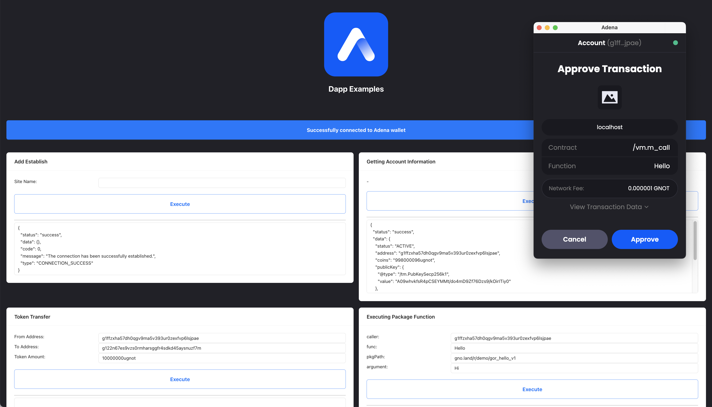

# Adena Connect For React App

Sample App Demo (https://onbloc.github.io/dapp-example)



---

## Getting Started

1. Install Node Packages

```bash
$ npm install
```

2. Start

```bash
$ npm start
```

3. Build

```bash
$ npm build
```

## Usage

Check if Adena wallet exists.

```javascript
// checks the existence of the adena object in window

const existsWallet = () => {
    if (window.adena) {
      return true;
    }
    return false;
};

```


Register your website as a trusted domain.

```javascript
// calls the AddEstablish of the adena object

const addEstablish = (siteName) => {
  return window?.adena?.AddEstablish(siteName);
};

```


Retrieve information about the connected account.

```javascript
// calls the GetAccount function of the adena object

const getAccount = () => {
    return window.adena?.GetAccount();
};

```


Request approval of a transaction that transfers tokens.

```javascript
// Execute the DoContract function of the adena object to request transaction.

const doContractSendToken = (fromAddress, toAddress, sendAmount) => {
  const sendTokenMessage = {
    type: "/bank.MsgSend",
    value: {
      from_address: fromAddress,
      to_address: toAddress,
      amount: sendAmount
    }
  };

  return window.adena?.DoContract({
    messages: [sendTokenMessage],
    gasFee: 1,
    gasWanted: 3000000
  });
};

```


Request approval of a transaction that calls a function from a realm.

```javascript
// Execute the DoContract function of the adena object to request transaction.

const doContractUseRealm = (caller, func, pkgPath, argument) => {

  // Setup Transaction Message
  const sendTokenMessage = {
    type: "/vm.m_call",
    value: {
      caller,
      func,
      send: "",
      pkg_path: pkgPath,
      args: argument.split(',')
    }
  };

  // Request Transaction
  return window.adena?.DoContract({
    messages: [sendTokenMessage],
    gasFee: 1,
    gasWanted: 3000000
  });
};


```